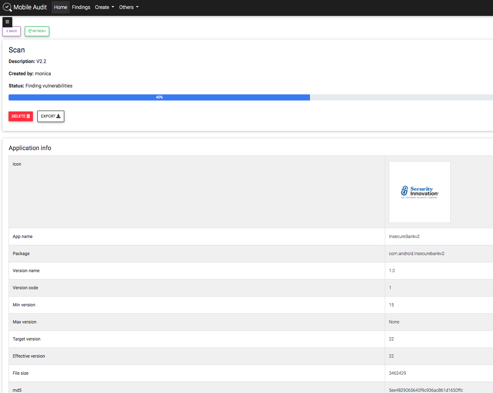
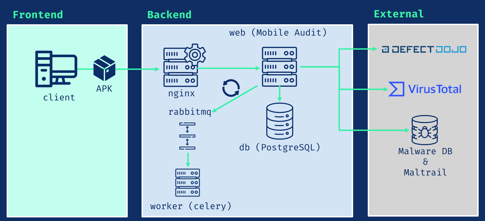
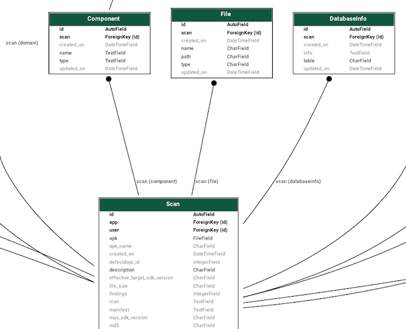
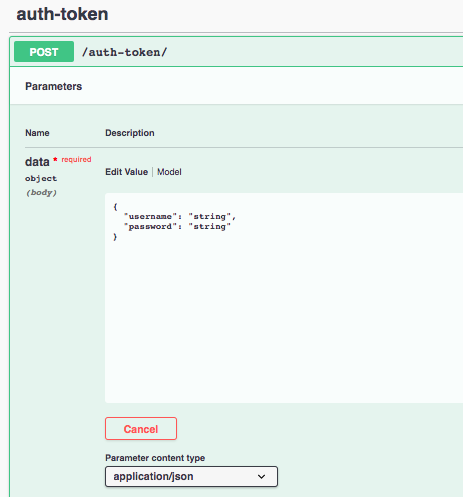

## Mobile Audit


**MobileAudit** - SAST and Malware Analysis for Android Mobile APKs

A Django web application to perform static analysis and detect malicious content inside Android APKs. The project extracts app metadata, scans source code for weaknesses, and aggregates results (SAST findings, best practices, certificate info, strings, databases, files, VirusTotal, and more) into a browsable dashboard and API.

DeepWiki documentation: https://deepwiki.com/mpast/mobileAudit

- [Components](#components)
- [Docker Base images](#docker-base-images)
- [Main features](#main-features)
- [Patterns](#patterns)
- [Models](#models)
- [Installation](#installation)
- [API v1](#api-v1)
  - [Usage](#usage)
  - [Swagger](#swagger)
  - [ReDoc](#redoc)
  - [Endpoints](#endpoints)
- [TLS](#tls)
  - [Pre-requirements](#pre-requirements)
  - [Nginx configuration](#nginx-configuration)
  - [Docker configuration](#docker-configuration)
- [Environment variables](#environment-variables)
---------------------------------------


In each of the scans, it would have the following information:

- APK information and analysis: Application info, security info, components, certificate info, strings, databases, files
- SAST findings categorized with CWE and Mobile Top 10 mapping
- Pattern engine with toggleable rules
- Malware domain checks against MalwareDB & Maltrail
- VirusTotal (API v3) lookup & optional upload (disabled by default)
- DefectDojo integration (API v2) (optional) for exporting findings
- API with Swagger and ReDoc, plus token-based authentication
- Export scan reports to PDF
- Findings editable with false-positive triage



For easy access there is a sidebar on the left page of the scan:


### Components



- **db**: PostgreSQL 3.11.5
- **nginx**: Nginx 1.23.3
- **rabbitmq**: RabbitMQ 3.11.5
- **worker**: Celery 5.2.2
- **web**: Mobile Audit App (Django 3.2.16)

### Docker Base images

Image is based on python buster. Link to [Docker Hub image](https://hub.docker.com/repository/docker/mpast/mobile_audit)

| Image |  Tags | Base |
|--------------------|-------|--------------------- |
| mpast/mobile_audit | 3.0.0 | python:3.9.16-buster |
| mpast/mobile_audit | 2.2.1 | python:3.9.7-buster  |
| mpast/mobile_audit | 1.3.8 | python:3.9.4-buster  |
| mpast/mobile_audit | 1.0.0 | python:3.9.0-buster  |

### Main features
- Runs in Docker for easy, reproducible deployment
- Extracts and shows detailed APK information
- SAST rules that map to CWE and Mobile Top 10 risks
- Malware indicators detection (MalwareDB / Maltrail)
- Integration points for VirusTotal and DefectDojo (optional)
- Export scan results to PDF
- User authentication, management, and token-based API
- Swagger and ReDoc documentation
- TLS-ready Nginx configuration for production

Planned / wishlist
- LDAP integration
- Export to Markdown / CSV
- Dynamic page reload improvements (WIP)

### Patterns
- The app includes a rule/pattern engine that detects potential vulnerabilities and malicious snippets inside APKs.
- Patterns are configurable and can be enabled/disabled from the `/patterns` UI.
- Note: Some hardcoded patterns are derived from the apkleaks project: https://github.com/dwisiswant0/apkleaks


### Models
The application has an created models for each of the entities of the scans' information to be able to create relations an abtain the best conclusions for each of the apks.



To see the whole model schema, go to [models](app/static/models.png)


### Installation

Using Docker-compose:

The provided `docker-compose.yml` file allows you to run the app locally in development.

To build the local image and if there are changes to the local Application Dockerfile, you can build the image with:

```sh
docker-compose build
```

Then, to start the container, run:

```sh
docker-compose up
```

Optional: run in detached mode (not see the logs)

```sh
docker-compose up -d
```

Once the application has launched, you can test the application by navigating to: http://localhost:8888/ to access the dashboard.


Also, there is a TLS version using `docker-compose.prod.yaml` running in port 443


To use it, execute
```sh
  docker-compose -f docker-compose.prod.yaml up
```

Then, you can test the application by navigating to: https://localhost/ to access the dashboard.

For more information, see [TLS](#tls)

To stop and remove the containers, run

```sh
docker-compose down
```

### API v1

REST API integration with Swagger and ReDoc.

#### Usage

* Endpoint to authenticate and get token:
`/api/v1/auth-token/`



* Once authenticated, use header in all requests:
`Authorization: Token <ApiKey>`

#### Swagger


#### ReDoc


#### Endpoints

* A JSON view of the API specification at `/swagger.json`
* A YAML view of the API specification at `/swagger.yaml`
* A swagger-ui view of the API specification at `/swagger/`
* A ReDoc view of the API specification at `/redoc/`

### TLS

#### Pre-requirements

* Add the certificates into `nginx/ssl`
* To generate a self-signed certificate:

```sh
openssl req -x509 -nodes -days 1 -newkey rsa:4096 -subj "/C=ES/ST=Madrid/L=Madrid/O=Example/OU=IT/CN=localhost" -keyout nginx/ssl/nginx.key -out nginx/ssl/nginx.crt
```

#### Nginx configuration

* TLS - port 443: `nginx/app_tls.conf`
* Standard - port 8888: `nginx/app.conf`

#### Docker configuration

By default, there is a volume in `docker-compose.yml` with the configuration with 8888 available

```yml
- ./nginx/app.conf:/etc/nginx/conf.d/app.conf
```

**In a production environment** use `docker-compose.prod.yaml` with port 443
```yml
- ./nginx/app_tls.conf:/etc/nginx/conf.d/app_tls.conf
```

### Environment variables

All the environment variables are in a `.env` file, there is an `.env.example` with all the variables needed. Also there are collected in `app/config/settings.py`
Suggested minimum `.env` adjustments for local dev
- Set SECRET_KEY, DB credentials, and admin user credentials.
- Leave VirusTotal / DefectDojo disabled unless you have valid API keys and services available.

### Contributing

If you like to contribute, see [Contributing](CONTRIBUTING.md)

---
