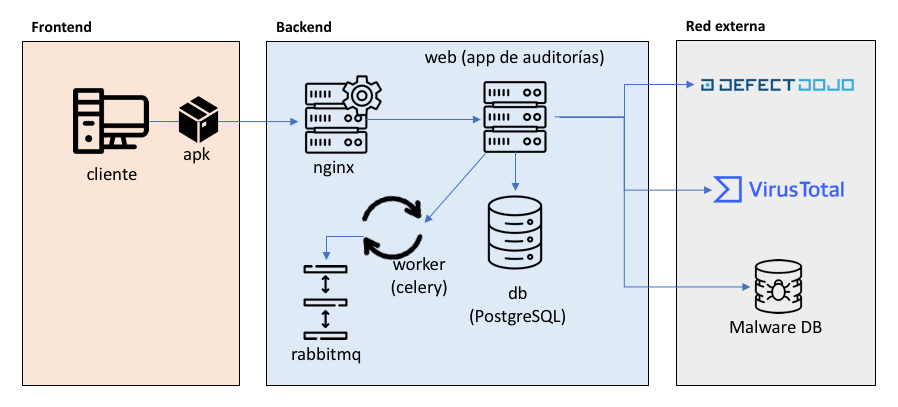
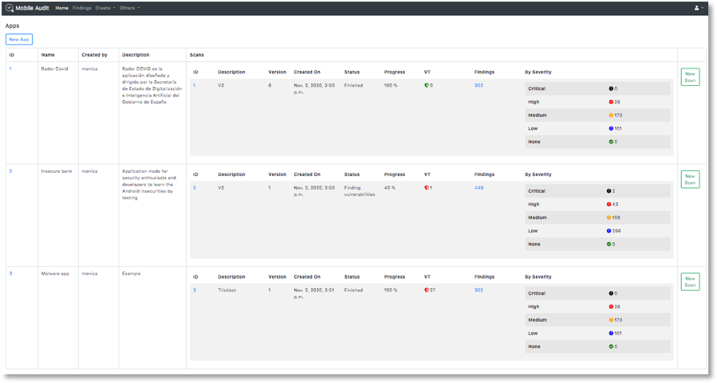
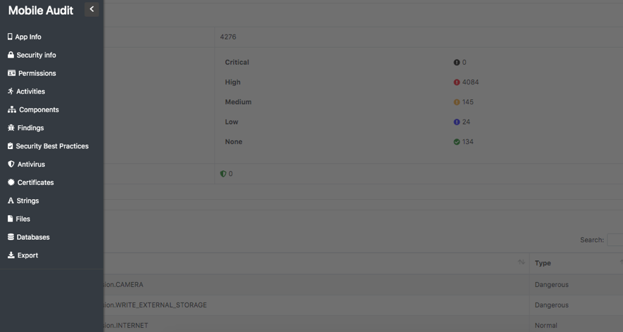

## Mobile Audit


**MobileAudit** - SAST and Malware Analysis for Android Mobile APKs

---------------------------------------


Django Web application for performing Static Analysis and detecting malware in Android APKs

### Main features

- Uses Docker for easy deployment in multiplatform environment
- Extract all information of the APK
- Analyze all the source code searching for weaknesses
- All findings are categorized and follows CWE standards
- Also highlight the Best Practices in Secure Android Implementation in the APK
- The findings can be edited and the false positives can be triaged and deleted
- All scan results can be exported to PDF
- User authentication and user management

### Integrations

- Virus Total (API v3): it checks if there has been an scan of the APK and extract all its information. Also, there is the possibility of uploading the APK is selected a property in the environment (Disabled by default).
- Defect Dojo (API v2): it is possible to upload the findings to the defect manager.
- MalwareDB: it checks in the database if there are URLs in the APK that are related with Malware.

### Components

- **db**: PostgreSQL 13
- **nginx**: Nginx 1.18.0
- **web**: Android Audit App




### Install

Using Docker-compose:

The provided `docker-compose.yml` file allows you to run the app locally in development. To start the container, run:

```sh
docker-compose up
```

If there are changes to the local Application Dockerfile, you can build the image with 

```sh
docker-compose build
```

Once the application has launched, you can test the application by navigating to: http://localhost:8888/ to access the dashboard.



In each of the scans, it would have the following information:

* Application Info
* Security Info
* Components
* SAST Findings
* Best Practices Implemented
* Virus Total Info
* Certificate Info
* Strings
* Databases
* Files

For easy access there is a sidebar on the left page of the scan:



### Configuration

All the environment variables are in a `.env` file, there is an `.env.example` with all the variables needed. Also there are collected in `app/config/settings.py`:

```py
CWE_URL = env('CWE_URL', 'https://cwe.mitre.org/data/definitions/')

MALWAREDB_ENABLED = env('MALWAREDB_ENABLED', True)
MALWAREDB_URL = env('MALWAREDB_URL', 'https://www.malwaredomainlist.com/mdlcsv.php')

VIRUSTOTAL_ENABLED = env('VIRUSTOTAL_ENABLED', False)
VIRUSTOTAL_URL = env('VIRUSTOTAL_URL', 'https://www.virustotal.com/')
VIRUSTOTAL_FILE_URL = env('VIRUSTOTAL_FILE_URL', 'https://www.virustotal.com/gui/file/')
VIRUSTOTAL_API_URL_V3 = env('VIRUSTOTAL_API_URL_V3', 'https://www.virustotal.com/api/v3/')
VIRUSTOTAL_URL_V2 = env('VIRUSTOTAL_API_URL_V2', 'https://www.virustotal.com/vtapi/v2/file/')
VIRUSTOTAL_API_KEY = env('VIRUSTOTAL_API_KEY', '')
VIRUSTOTAL_UPLOAD = env('VIRUSTOTAL_UPLOAD', False)

DEFECTDOJO_ENABLED = env('DEFECTDOJO_ENABLED', False)
DEFECTDOJO_URL = env('DEFECTDOJO_URL', 'http://defectdojo:8080/finding/')
DEFECTDOJO_API_URL = env('DEFECTDOJO_API_URL', 'http://defectdojo:8080/api/v2/')
DEFECTDOJO_API_KEY = env('DEFECTDOJO_API_KEY', '')
```