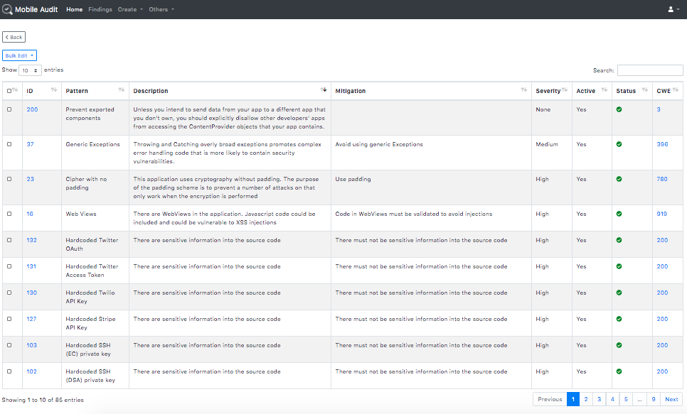

# Mobile Audit

Static security analysis and malware inspection for Android APKs.

Mobile Audit is a Django application that extracts APK metadata, scans source code for weaknesses, checks malware indicators, and brings the results together in a focused security workspace. Findings can be triaged in the UI, explored through the REST API, or exported as PDF reports.


## What it does

- Extracts application, component, certificate, permission, string, database, and file metadata
- Detects SAST findings with CWE and Mobile Top 10 mappings
- Checks domains against MalwareDB and Maltrail sources
- Supports optional VirusTotal lookups and uploads
- Exports findings to DefectDojo through its API v2 integration
- Provides finding triage, including false-positive management
- Exposes a token-authenticated API with Swagger and ReDoc documentation
- Generates PDF scan reports


The interface uses Bootstrap 5 with a small native JavaScript layer for navigation, filtering, sorting, pagination, confirmations, and status updates. jQuery and the previous Bootstrap 4 runtime are no longer required.

## Quick start

Docker Compose starts PostgreSQL, Django, Nginx, RabbitMQ, and the Celery worker together.

```sh
docker compose build
docker compose up
```

Open [http://localhost:8888](http://localhost:8888) after the services are ready.

To run in the background or stop the stack:

```sh
docker compose up -d
docker compose down
```

Review `.env.example` before starting. For any shared or production environment, replace the example secret, database credentials, and administrator credentials with secure values. VirusTotal, DefectDojo, and malware checks remain optional.

## Architecture


| Service | Responsibility |
| --- | --- |
| Django | Web application and REST API |
| PostgreSQL 16 | Persistent application data |
| Celery | Background APK analysis |
| RabbitMQ 4.2 | Task broker |
| Nginx | HTTP or TLS entry point |

The application currently targets Django 5.2 LTS and Python 3.12.

## Analysis patterns

The pattern engine finds potentially vulnerable or malicious snippets in decompiled APK content. Rules can be enabled or disabled from the **Patterns** screen.

Some hardcoded patterns are derived from [apkleaks](https://github.com/dwisiswant0/apkleaks).



## API v1

Request an API token from:

```text
POST /api/v1/auth-token/
```

Send the token with subsequent requests:

```text
Authorization: Token <api-key>
```

Interactive and machine-readable documentation is available at:

| Format | Path |
| --- | --- |
| Swagger UI | `/swagger/` |
| ReDoc | `/redoc/` |
| OpenAPI JSON | `/swagger.json` |
| OpenAPI YAML | `/swagger.yaml` |

## TLS deployment

Place the certificate and key in `nginx/ssl`, then start the production Compose configuration:

```sh
docker compose -f docker-compose.prod.yaml up -d
```

The TLS stack is available at [https://localhost](https://localhost). The relevant Nginx configurations are:

- `nginx/app.conf` for local HTTP on port 8888
- `nginx/app_tls.conf` for HTTPS on port 443

For local testing, a one-day self-signed certificate can be generated with:

```sh
openssl req -x509 -nodes -days 1 -newkey rsa:4096 \
  -subj "/C=ES/ST=Madrid/L=Madrid/O=Example/OU=IT/CN=localhost" \
  -keyout nginx/ssl/nginx.key \
  -out nginx/ssl/nginx.crt
```

## Project resources

- [Contributing guide](CONTRIBUTING.md)
- [DeepWiki documentation](https://deepwiki.com/mpast/mobileAudit)
- [Docker Hub image](https://hub.docker.com/repository/docker/mpast/mobile_audit)
- [Data model diagram](app/static/models.png)

## License

See [LICENSE](LICENSE).
