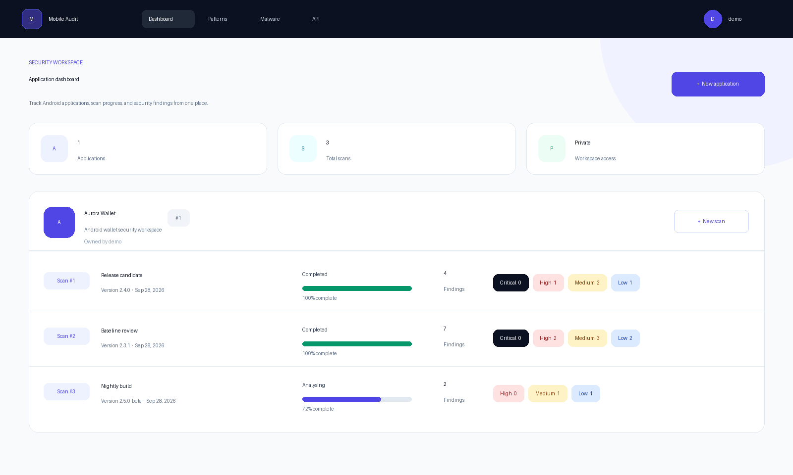
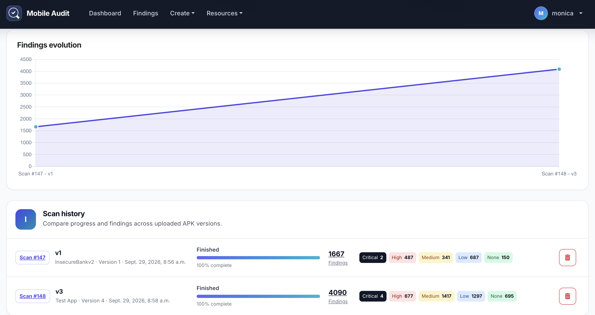
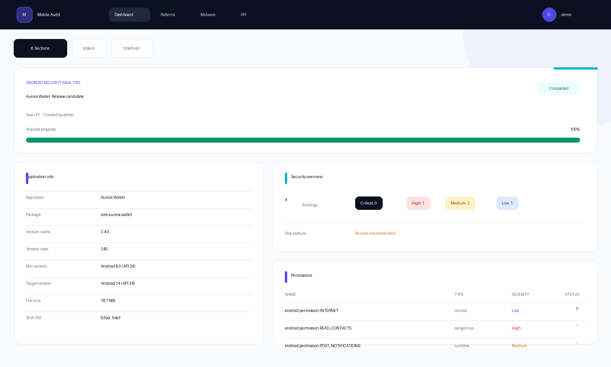
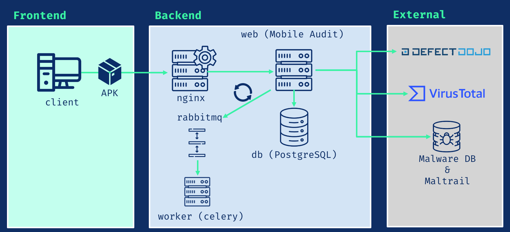

# Mobile Audit

Security analysis for Android APKs, from upload to actionable findings.

Mobile Audit is a Django application for static application security testing and malware inspection. It extracts APK metadata, detects risky implementation patterns, organizes findings by severity, and provides a focused workspace for review and reporting.

## Get started

Docker Compose runs the complete local stack: Django, PostgreSQL, RabbitMQ, Celery, and Nginx.

~~~sh
docker compose build
docker compose up
~~~

Open [http://localhost:8888](http://localhost:8888) when the services are ready.

To run in the background or stop the stack:

~~~sh
docker compose up -d
docker compose down
~~~

Before using Mobile Audit outside a local environment, replace the example secret, database credentials, and administrator credentials in **.env.example**.

## Core capabilities

| Area | What Mobile Audit provides |
| --- | --- |
| APK inspection | Application metadata, components, permissions, certificates, strings, databases, and files |
| Static analysis | Configurable SAST rules with CWE and Mobile Top 10 mappings |
| Malware checks | Domain checks against MalwareDB and Maltrail sources |
| Finding management | Severity summaries, detailed evidence, editing, and false-positive triage |
| Integrations | Optional VirusTotal inspection and DefectDojo export |
| Reporting | PDF exports plus a token-authenticated REST API |

## Interface tour

### Application workspace

Review an application's scan history and compare how its finding count changes between APK versions.

### Scan analysis

Move from the security summary into application metadata, permissions, components, findings, certificates, strings, files, and databases.

The interface uses Bootstrap 5 and native JavaScript. Navigation, live table filtering, sorting, pagination, confirmations, and scan status updates do not require jQuery.

## Analysis workflow

1. Create an application workspace.
2. Upload an APK and start a scan.
3. Review severity totals and inspect the supporting evidence.
4. Triage findings, export a PDF report, or use an integration.

Analysis rules can be enabled or disabled from the **Patterns** screen. Some hardcoded patterns are derived from [apkleaks](https://github.com/dwisiswant0/apkleaks).

## Architecture

| Service | Responsibility |
| --- | --- |
| Django 5.2 LTS | Web application and REST API |
| PostgreSQL 16 | Persistent application data |
| Celery | Background APK analysis |
| RabbitMQ 4.2 | Task broker |
| Nginx | HTTP or TLS entry point |

The application runtime uses Python 3.12. APK decompilation is provided by JADX.

## API

Request a token:

~~~text
POST /api/v1/auth-token/
~~~

Authenticate subsequent requests:

~~~text
Authorization: Token <api-key>
~~~

| Documentation | Path |
| --- | --- |
| Swagger UI | /swagger/ |
| ReDoc | /redoc/ |
| OpenAPI JSON | /swagger.json |
| OpenAPI YAML | /swagger.yaml |

## Optional integrations

The following features are disabled by default and configured through **.env.example**:

- VirusTotal API v3 lookups and optional uploads
- DefectDojo API v2 finding exports
- MalwareDB and Maltrail domain checks

Enable only the services for which you have valid endpoints and credentials.

## TLS

Place the certificate and private key in **nginx/ssl**, then start the TLS configuration:

~~~sh
docker compose -f docker-compose.prod.yaml up -d
~~~

The application will be available at [https://localhost](https://localhost).

For local testing, generate a one-day self-signed certificate:

~~~sh
openssl req -x509 -nodes -days 1 -newkey rsa:4096 \
  -subj "/C=ES/ST=Madrid/L=Madrid/O=Example/OU=IT/CN=localhost" \
  -keyout nginx/ssl/nginx.key \
  -out nginx/ssl/nginx.crt
~~~

## Project resources

- [Contributing guide](CONTRIBUTING.md)
- [DeepWiki documentation](https://deepwiki.com/mpast/mobileAudit)
- [Docker Hub image](https://hub.docker.com/repository/docker/mpast/mobile_audit)
- [License](LICENSE)
